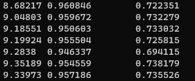

PAV - P3: detección de pitch
============================

Esta práctica se distribuye a través del repositorio GitHub [Práctica 3](https://github.com/albino-pav/P3).
Siga las instrucciones de la [Práctica 2](https://github.com/albino-pav/P2) para realizar un `fork` de la
misma y distribuir copias locales (*clones*) del mismo a los distintos integrantes del grupo de prácticas.

Recuerde realizar el *pull request* al repositorio original una vez completada la práctica.

Ejercicios básicos
------------------

- Complete el código de los ficheros necesarios para realizar la detección de pitch usando el programa
  `get_pitch`.

   * Complete el cálculo de la autocorrelación e inserte a continuación el código correspondiente.

   Esta función la encontramos en el fichero ***pitch_analyzer.cpp*** dentro de la carpeta *get_pitch*. 

   Tal como se explicó en la clase de laboratorio, el código de la autocorrelación de una señal discreta es el siguiente:

   <kbd></kbd>

   * Inserte una gŕafica donde, en un *subplot*, se vea con claridad la señal temporal de un segmento de
     unos 30 ms de un fonema sonoro y su periodo de pitch; y, en otro *subplot*, se vea con claridad la
	 autocorrelación de la señal y la posición del primer máximo secundario.

   Hemos grabado una señal con el con el sonido de la vocal 'a' a una frecuencia de 16 kHz.
   A continuación, hemos realizado un código Matlab y generado una gráfica con la señal temporal de esta y otra de la autocorrelación a partir de la misma estructura del código anterior de nuestro programa con el objetivo de corroborar los cálculos para el análisis del pitch.

   El código y los resultados son los siguientes:

   <kbd></kbd>

   <kbd></kbd>

   Analizando ambas gráficas, podemos observar en la primera que el periodo de nuestra señal es de 121 muestras. Es decir, que el periodo fundamental es P0 = L/fs = 121/16kHz = 7,56ms. Haciendo la inversa, obtenemos la frecuencia fundamental (pitch), f0 = 1/P0 = 132,23 Hz.

   Por otro lado, en la segunda gráfica, vemos que el segundo máximo de la autocorrelación está en la posición k = 124. Convirtiendo esta en frecuencia obtenemos también el pitch, f0 = fs/k = 16kHz/124 = 129,03 Hz.

   A modo de conclusión, el pitch de nuestra señal es aprox. 130 Hz y nuestro código funciona correctamente.

   Como 
	 NOTA: es más que probable que tenga que usar Python, Octave/MATLAB u otro programa semejante para
	 hacerlo. Se valorará la utilización de la librería matplotlib de Python.

   * Determine el mejor candidato para el periodo de pitch localizando el primer máximo secundario de la
     autocorrelación. Inserte a continuación el código correspondiente.

     El objetivo del siguiente código es iterar en el intervalo del [npitch_min, npitch_max] hasta encontrar la posición del máximo secundario.

     <kbd></kbd>

     A continuación, si ejecutamos nuestro programa de detección de pitch a nuestra señal vocálica, el resultado es el siguiente:

     ***~/PAV/P3$ get_pitch vowel.wav vowel.f0***

     ***~/PAV/P3$ less vowel.f0***

     <kbd></kbd>

     Evidentemente, como hemos visto antes en Matlab, para cada trama de 30ms nuestro pitch es 131 Hz aprox., excepto la primera y la última trama que sirven para alinear la estimación.

   * Implemente la regla de decisión sonoro o sordo e inserte el código correspondiente.

   En el fichero ***pitch_analyzer.cpp*** dentro de la carpeta *get_pitch*, en las últimas líneas tenemos un código comentado para poder imprimir por pantalla algunas características de nuestra señal de autocorrelación.
   Si la descomentamos, y corremos nuestro programa con nuestro fichero wave anterior obtenemos el siguiente resultado:

   <kbd></kbd>

   Por lo tanto, para nuestra primera versión la regla de decisión básica es la siguiente:

   <kbd></kbd>

   Hay que tener en cuenta que esta regla de decisión es poco eficaz ya que la hemos elaborado a partir de los resultados de una sola señal. Lo más eficaz es realizar este estudio a partir de una base de datos que lo haremos a continuación.

- Una vez completados los puntos anteriores, dispondrá de una primera versión del detector de pitch. El 
  resto del trabajo consiste, básicamente, en obtener las mejores prestaciones posibles con él.

  * Utilice el programa `wavesurfer` para analizar las condiciones apropiadas para determinar si un
    segmento es sonoro o sordo. 
	
	  - Inserte una gráfica con la detección de pitch incorporada a `wavesurfer` y, junto a ella, los 
	    principales candidatos para determinar la sonoridad de la voz: el nivel de potencia de la señal
		(r[0]), la autocorrelación normalizada de uno (r1norm = r[1] / r[0]) y el valor de la
		autocorrelación en su máximo secundario (rmaxnorm = r[lag] / r[0]).

		Puede considerar, también, la conveniencia de usar la tasa de cruces por cero.

	    Recuerde configurar los paneles de datos para que el desplazamiento de ventana sea el adecuado, que
		en esta práctica es de 15 ms.

    Primero generamos los distintos ficheros de nuestra señal voz para poder representarlas en el wavesurfer. Para ello, hemos utilizado el audio *sb048.wav* de la base de datos.
    Para el contorno de Pitch de cada trama simplemente hacemos correr la función *get_pitch*:

    ***~/PAV/P3$ get_pitch sb048.wav sb048.f0***

    Para generar el valor de la potencia de la señal en cada tramo, editamos el fichero *pitch_analyzer.cpp* y en lugar de retornar *samplingFreq* retornamos la variable *pot*.

    ***~/PAV/P3$ get_pitch sb048.wav sb048.pot***

    De la misma manera para la autocorrelación normalizada de uno y el valor de la autocorrelación en su máximo secundario.

    ***~/PAV/P3$ get_pitch sb048.wav sb048.r1norm***

    ***~/PAV/P3$ get_pitch sb048.wav sb048.rmaxnorm***

    Finalmente, representamos estas informaciones en distintos Data plots en Wavesurfer.

    El resultado es el siguiente:

    <kbd></kbd>

    Como podemos ver, determinamos que un trama será sordo (Unvoiced) si la potencia es inferior a **-32,48 dB**.

    Por otro lado, para la autocorrelación normalizada de uno, decidiremos **0,85** y para la autocorrelación en su máximo secundario **0,35**.

      - Use el detector de pitch implementado en el programa `wavesurfer` en una señal de prueba y compare
	    su resultado con el obtenido por la mejor versión de su propio sistema.  Inserte una gráfica
		ilustrativa del resultado de ambos detectores.

    <kbd></kbd>
  
  * Optimice los parámetros de su sistema de detección de pitch e inserte una tabla con las tasas de error
    y el *score* TOTAL proporcionados por `pitch_evaluate` en la evaluación de la base de datos 
	`pitch_db/train`..

   * Inserte una gráfica en la que se vea con claridad el resultado de su detector de pitch junto al del
     detector de Wavesurfer. Aunque puede usarse Wavesurfer para obtener la representación, se valorará
	 el uso de alternativas de mayor calidad (particularmente Python).
   

Ejercicios de ampliación
------------------------

- Usando la librería `docopt_cpp`, modifique el fichero `get_pitch.cpp` para incorporar los parámetros del
  detector a los argumentos de la línea de comandos.
  
  Esta técnica le resultará especialmente útil para optimizar los parámetros del detector. Recuerde que
  una parte importante de la evaluación recaerá en el resultado obtenido en la detección de pitch en la
  base de datos.

  * Inserte un *pantallazo* en el que se vea el mensaje de ayuda del programa y un ejemplo de utilización
    con los argumentos añadidos.

- Implemente las técnicas que considere oportunas para optimizar las prestaciones del sistema de detección
  de pitch.

  Entre las posibles mejoras, puede escoger una o más de las siguientes:

  * Técnicas de preprocesado: filtrado paso bajo, *center clipping*, etc.
  * Técnicas de postprocesado: filtro de mediana, *dynamic time warping*, etc.
  * Métodos alternativos a la autocorrelación: procesado cepstral, *average magnitude difference function*
    (AMDF), etc.
  * Optimización **demostrable** de los parámetros que gobiernan el detector, en concreto, de los que
    gobiernan la decisión sonoro/sordo.
  * Cualquier otra técnica que se le pueda ocurrir o encuentre en la literatura.

  Encontrará más información acerca de estas técnicas en las [Transparencias del Curso](https://atenea.upc.edu/pluginfile.php/2908770/mod_resource/content/3/2b_PS%20Techniques.pdf)
  y en [Spoken Language Processing](https://discovery.upc.edu/iii/encore/record/C__Rb1233593?lang=cat).
  También encontrará más información en los anexos del enunciado de esta práctica.

  Incluya, a continuación, una explicación de las técnicas incorporadas al detector. Se valorará la
  inclusión de gráficas, tablas, código o cualquier otra cosa que ayude a comprender el trabajo realizado.

  También se valorará la realización de un estudio de los parámetros involucrados. Por ejemplo, si se opta
  por implementar el filtro de mediana, se valorará el análisis de los resultados obtenidos en función de
  la longitud del filtro.
   

Evaluación *ciega* del detector
-------------------------------

Antes de realizar el *pull request* debe asegurarse de que su repositorio contiene los ficheros necesarios
para compilar los programas correctamente ejecutando `make release`.

Con los ejecutables construidos de esta manera, los profesores de la asignatura procederán a evaluar el
detector con la parte de test de la base de datos (desconocida para los alumnos). Una parte importante de
la nota de la práctica recaerá en el resultado de esta evaluación.
